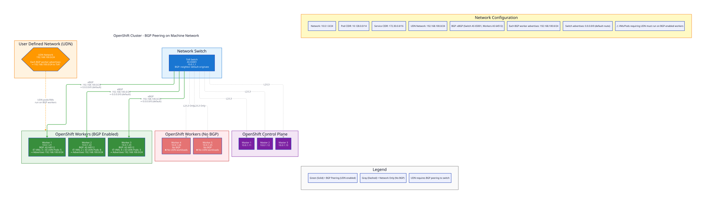

# OpenShift BGP Network Architecture Diagrams

Network architecture diagrams for OpenShift clusters with BGP configuration, showing how User Defined Networks (UDN) are advertised via BGP peering at the node and switch layers.

## Overview

These diagrams illustrate BGP-based networking for OpenShift clusters, specifically focusing on:
- BGP peering configurations between worker nodes and ToR switches
- User Defined Network (UDN) route advertisement
- Default route distribution via `neighbor default-originate`
- Node requirements for hosting UDN workloads

## Architecture: BGP Peering on Machine Network

This architecture shows BGP peering established on the same network interface and subnet (machine network) used for node management traffic.

### Detailed View



**Key Components:**

- **ToR Switch (AS 65001)**
  - Single switch layer on machine network (10.0.1.0/24)
  - Configured with `neighbor default-originate` to advertise default route
  - Receives UDN routes from BGP-enabled workers

- **Control Plane Nodes (No BGP)**
  - Masters do not participate in BGP
  - Standard L2/L3 network connectivity only
  - IPs: 10.0.1.11-13

- **BGP-Enabled Workers (AS 64512)**
  - Workers 1-3 run FRR BGP speakers
  - Advertise UDN routes to ToR switch (← UDN Routes)
  - Receive default route from switch (→ neighbor default-originate)
  - Can host VMs and UDN pods (📦 🔷)
  - IPs: 10.0.1.21-23

- **Non-BGP Workers**
  - Workers 4-5 have no BGP configuration
  - Network connectivity only (no route advertisement)
  - **Cannot host UDN workloads** ❌
  - IPs: 10.0.1.24-25

### Simplified View



This simplified view highlights:
- BGP peering relationships
- Workload placement constraints
- Route advertisement directionality

## Network Configuration Details

### Machine Network
```
Subnet: 10.0.1.0/24
Gateway: 10.0.1.1 (ToR Switch)
```

### OpenShift Network CIDRs
```
Pod CIDR:     10.128.0.0/14
Service CIDR: 172.30.0.0/16
UDN Pool:     192.168.100.0/24
```

### BGP Configuration

**Switch (AS 65001):**
- Receives UDN routes from workers via eBGP
- Advertises default route using `neighbor default-originate`

**Workers (AS 64512):**
- Run FRR BGP daemon
- Peer with ToR switch (10.0.1.1)
- Advertise UDN routes (192.168.100.0/24)
- Accept default route (0.0.0.0/0)

## Critical Requirements

### ⚠️ UDN Workload Placement

**VMs and pods requiring User Defined Network (UDN) connectivity MUST run on BGP-enabled worker nodes.**

- ✅ **Supported:** Workers 1-3 (BGP peering active)
- ❌ **Not Supported:** Workers 4-5 (no BGP)

Workloads scheduled on non-BGP workers will not have their routes advertised and will be unreachable from the network.

## Architecture Benefits

1. **Simplified Network Design**
   - Single interface for management and BGP
   - No additional network interfaces required
   - Standard ToR switch configuration

2. **Selective BGP Enablement**
   - Only workers that need UDN require BGP
   - Control plane remains isolated from routing
   - Flexible worker pool management

3. **Standard BGP Features**
   - `neighbor default-originate` for gateway routes
   - eBGP for autonomous system separation
   - ECMP for load distribution across workers

## Use Cases

- **Bare Metal OpenShift**: Direct BGP peering with physical ToR switches
- **User Defined Networks**: Custom network namespaces for tenant isolation
- **VM Workloads**: KubeVirt VMs requiring external network access
- **Multi-Tenant Networking**: Isolated network segments per application

## File Formats

Diagrams are available in multiple formats:

- **SVG** (recommended for web): Scalable, crisp at any zoom level
- **PNG**: Raster format for embedding in documents
- **PDF**: Print-ready, suitable for documentation

## Contributing

Want to modify these diagrams or create new ones? See [CONTRIBUTING.md](CONTRIBUTING.md) for:
- Development setup
- D2 syntax guide
- Customization examples
- Git workflow

## Auto-Generated Diagrams

All diagram formats are automatically generated via GitHub Actions when `.d2` source files are updated. Developers only need to edit the `.d2` files and push - the CI/CD pipeline handles diagram generation and committing.

## License

This project is licensed under the MIT License - see the [LICENSE](LICENSE) file for details.

## Additional Resources

- [D2 Documentation](https://d2lang.com/)
- [OpenShift Networking Documentation](https://docs.openshift.com/)
- [FRR BGP Documentation](https://docs.frrouting.org/en/latest/bgp.html)
